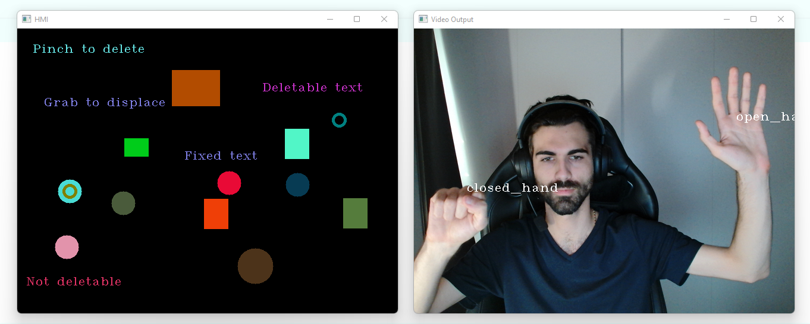

# Hand posture control for GUI

## Description
This package contains all requirements to add new classes, 
train those classes and use them to control a demo graphical user interface to interact with objects.

1. **create_dataset.py** : dataset class registering assisted by a tkinter interface.
2. **train.py** : Model training and visualizer.
   1. `python3 train.py` without arguments to train/re-train the model before visualizing.
   2. `python3 train.py --no_train` argument to avoid training and use visualizer only.
3. **HMI_demo.py** : Example Human Machine Interface using the pre-trained model and Mediapipe detection.

#### Screenshot


### Default configuration of the controller
*Closed hand* to grab an object.
*pinch* to delete object.
*index up* to create a ball.
*thumb up* to create a box.

Existing posture classes are present in [Assets/datasets_records](Assets/datasets_records).

The *.csv files are not necessary for the controller as the model is pretrained 
but the labels have to correspond to the model output.
The model output is trained with the *.csv files sorted alphabetically.

Escape key while focused on OpenCV video output window to end the process by default (key code 27).

### Used Packages

* **Mediapipe** - hand landmarks acquisition.
* **OpenCV** - low-level image processing and display.
* **TensorFlow - Keras** - Direct Neural Network for posture prediction.
* **Tkinter** - User interface for the dataset creation.

## HandVideoClassifier Class

### Class usage

The [HandVideoClassifier (HVC)](nico_lib/hvc_minilib.py) class handles :

1. **Video capture** from camera or source file 
*(will be updated with video buffering instead of direct output to avoid time differed prediction)*.
2. **Real time prediction** based on trained model.
3. **Video output** with optional labels on frame for debugging.
4. **Verbosity control** (Subprocess state information)

The labels shown on video can be passed in the `labels_on_vid` optional argument.

### Methods and attributes

#### Initialisation

```python
from nico_lib.hvc_minilib import HandVideoClassifier

hvc = HandVideoClassifier(model_path="Assets/model_data/model.h5",
                          stream_path=0,  # To use camera at port 0 (default)
                          video_output=True,  # or a list/1D-array of labels
                          verbose=True,  # outputs subprocess behavior to console
                          labels_on_vid=None,  # Or a list/1D-array of labels
                          always_on_top=True)  # keeps video output in front of other apps
```

#### Process startup

```python
from nico_lib.hvc_minilib import HandVideoClassifier
hvc = HandVideoClassifier("Assets/model_data/model.h5")

hvc.start()  # Begins acquisition subprocess
```

#### Get prediction

```python
from nico_lib.hvc_minilib import HandVideoClassifier

hvc = HandVideoClassifier("Assets/model_data/model.h5").start()

prediction = hvc.get_predictions()  # Returns the prediction made on last frame
```

#### Get running state

```python
from nico_lib.hvc_minilib import HandVideoClassifier
hvc = HandVideoClassifier("Assets/model_data/model.h5").start()

state = hvc.is_running()  # Returns the running state of the detection subprocess (bool)
```

#### Stop subprocess and release video source

```python
from nico_lib.hvc_minilib import HandVideoClassifier
hvc = HandVideoClassifier("Assets/model_data/model.h5").start()

hvc.stop()
```

#### Attributes

```python
from nico_lib.hvc_minilib import HandVideoClassifier
hvc = HandVideoClassifier("Assets/model_data/model.h5").start()

labels = hvc.labels  # Retrieve the labels passed in argument
model_path = hvc.model_path  # Retrieve the model path passed in argument
```

#### Get hands location

```python
from nico_lib.hvc_minilib import HandVideoClassifier
hvc = HandVideoClassifier("Assets/model_data/model.h5").start()

hands_coords = hvc.get__hands_coords()
```

## Element creation and GUI Class

### Element subclasses usage

#### Box, Ball and Text creation

```python
from nico_lib.hmi_minilib import Ball, Box, Text
import cv2

box = Box(initial_position=[50, 50],
          box_size=[20, 50],
          color=(0.3, 0.7, 0.5),
          can_be_grabbed=True,
          deletable=True)

ball = Ball(initial_position=[200, 100],
            ball_radius=10,
            color=(0.3, 0.7, 0.5),
            can_be_grabbed=True,
            deletable=True)

text = Text(initial_position=[300, 200],
            text="Example text",
            cv2_font=cv2.FONT_HERSHEY_COMPLEX,
            font_size=0.8,
            color=(0.2, 0.3, 0.9),
            can_be_grabbed=True,
            deletable=False)
```

#### Set the position of the object on GUI

```python
from nico_lib.hmi_minilib import Ball

ball = Ball(initial_position=[40, 30])

# ACTIONS ...

ball.set_position(position=[20, 10])
```

#### Get the position of the object on GUI

```python
from nico_lib.hmi_minilib import Box

box = Box(initial_position=[40, 30])

# ACTIONS ...

actual_position = box.get_position()
```

#### Set the state of the object to grabbed

```python
from nico_lib.hmi_minilib import Text

text = Text(initial_position=[40, 30])

# ACTIONS ...

text.set_grabbed(grabbed=True, holder_index=1)  # holder hand index accessible through Element.grabbed_by
```

#### Check the grabbed state of the object

```python
from nico_lib.hmi_minilib import Ball

ball = Ball(initial_position=[40, 30])

# ACTIONS ...

is_grabbed = ball.is_grabbed()
```

#### Get hit box (for grab, and delete)

```python
from nico_lib.hmi_minilib import Ball

ball = Ball(initial_position=[40, 30])

# ACTIONS ...

hit_box = ball.get_hit_box()
```

### GUI class usage

#### Initialisation

```python
from nico_lib.hmi_minilib import GUI

gui = GUI(window_name="Example HMI")
```

#### Usage in loop with HandVideoClassifier

```python
from nico_lib.hmi_minilib import GUI, Box
from nico_lib.hvc_minilib import HandVideoClassifier
import cv2

gui = GUI(window_name="Example HMI")
hvc = HandVideoClassifier(model_path="Assets/model_data/model.h5")

box = Box(initial_position=[50, 80])
gui.add_object(box)

while True:
    hands_predictions = hvc.get_predictions()
    hands_positions = hvc.get__hands_coords()
    gui.set_hands_coords(hands_positions)
   
    # ACTIONS ...
   
    gui.draw()
    if cv2.waitKey(1) == 27:  # Escape KeyCode is 27
        break
```
